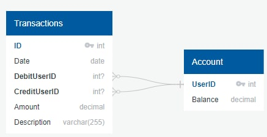

# Тестовое задание на позицию стажера-бекендера

## Задание
Описание задания вынесено в [TASK.md](docs/TASK.md)

## Решение

### API
Спецификация API составлена при помощи OpenAPI: [openapi.yaml](docs/api/openapi.yaml) 

### Схема БД

SQL скрипты представлены в директории [scripts](scripts)

### Стэк технологий
* GORM
* Gin
* PostgreSQL

### Запуск
Здесь будет хорошее описание, как запустить микросервис

### Примеры
Здесь будут примеры запросов и ответов
