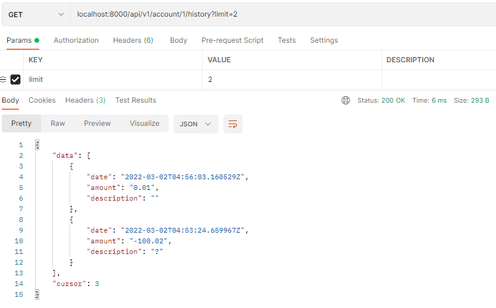
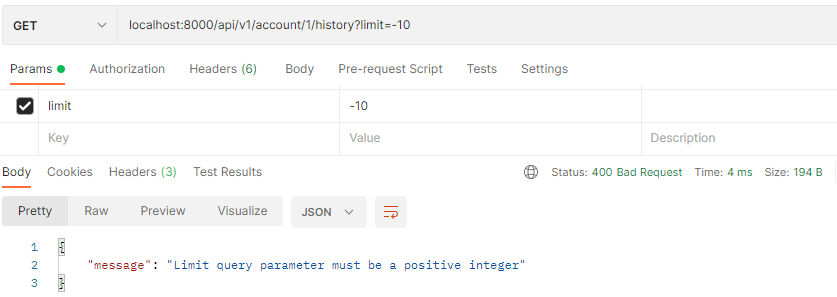

# Тестовое задание на позицию стажера-бекендера

## Задание

Описание задания вынесено в [TASK.md](docs/TASK.md)

## Решение

### Ответы на возникшие вопросы

> В нашей компании есть много различных микросервисов. Многие из них так или иначе хотят взаимодействовать
> с балансом пользователя. На архитектурном комитете приняли решение централизовать работу с балансом пользователя
> в отдельный сервис.

Исходим из того, что у пользователя один баланс в системе. Тогда можно создать абстракцию счёта для пользователя.
Счёт пользователя и пользователь имеют связь один к одному, так что можно работать с идентификатором пользователя
как с индентификатором и его счёта

### API
Спецификация API составлена при помощи OpenAPI: [openapi.yaml](docs/api/openapi.yaml) 

### Схема БД


SQL скрипты представлены в директории [scripts](scripts)

### Стэк технологий

* OpenAPI
* Go
* GORM
* Gin
* PostgreSQL
* Docker & Docker Compose

### Запуск

```
git clone https://github.com/naumov-andrey/avito-intern-assignment.git
cd avito-intern-assignment/
```

Далее необходимо скопировать содержимое `.env.example` в `.env` и внести API ключ. В качестве источника информации 
о текущем курсе взят сервис [freecurrencyapi.net](https://freecurrencyapi.net)

Запуск Docker приложения:
```
docker compose up -d
```

Остановка Docker приложения:
```
docker compose down
```


### Примеры

#### GET /account/{userId}/balance


---


---


#### PUT /account/{userId}/balance


---


---


---


#### GET /account/{userId}/history


---



---


---


---


---


---


---



---


#### POST /account/transfer


---


---


---


---


---

